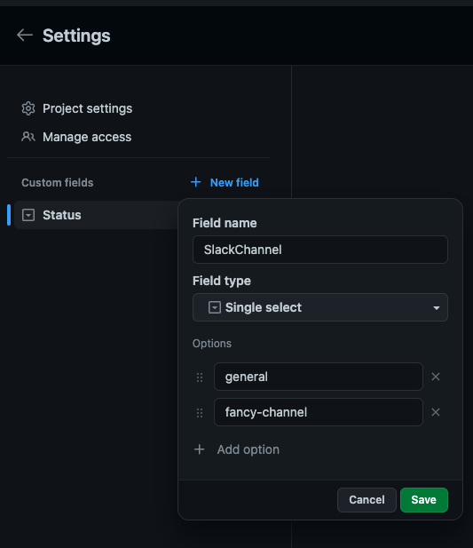

# Github board slack notifications
The purpose of this project is to sent notifications to a Slack channel for any changes that are performed in a GitHub board (Projects v2 / beta).
This application uses AWS Lambda as backend which is provisioned with Terraform.

## Features
Currently notifications are being sent for the following events:
- A Draft Issue is created on a board column that has a valid status. `No Status` column is not being notified.
- An existing Issue is added to a board column that has a valid status.
- A Draft Issue is converted to an Issue.
- An Issue or Draft Issue is moved to a different column that has a valid status.
- An Issue is removed from the board.

## Setup
In order for this integration to work, a GitHub App must be created and installed in the organisation that contains the targeted projects and a Slack application is required to post on the specified channels. 
The steps are the following:
1. Fork this repository
1. Create a Slack app by going to https://api.slack.com/apps and pressing the `Create New App` button.
1. Grab the Signing secret in the app page and save it as `PROD_SLACK_SIGNING_SECRET` in the `Secrets -> Actions` section of your GitHub repository. 
1. Navigate to the `OAuth & Permissions` on the left sidebar and scroll down to the Bot Token Scopes section. Click `Add an OAuth Scope`. Add the `chat:write` scope. Grab the generated `Bot User OAuth Token` and save it as `PROD_SLACK_TOKEN` in the GitHub repository secrets.
1. Create a new Secret in the GitHub repo named `PROD_ORG_WEBHOOK_SECRET` and set it to a random string of 16 or more characters. Save it for later.
1. Go to the Settings page of your organisations, then to `Developer settings` -> `GitHub apps`. The url should look something like https://github.com/organizations/your-organisation/settings/apps
1. Create a new GitHub App using the `New GitHub App` button
1. In the app creation page, after setting the name and application URL, you need to set the following permissions required by the app:
    - Repository:
      - Issues:read-only
      - Pull requests:read-only
    - Organisation:
      - Projects:read-only
1. In the `Permissions & events` page accessible for the GitHub app edit page, in the `Subscribe to events` section, check `Projects v2 item`
1. From the GitHub application edit page, grab the `App ID` and save it in the repo secrets as `PROD_ORG_APP_ID`
1. In the GitHub application edit page, go to the `Private keys` section an click on `Generate a private key`. The resulting PEM file will be downloaded automatically onto your computer. Open that file with a text editor and paste the key into a base64 encoder. Save the base64 converted string into the repo GitHub secrets as `PROD_ORG_PRIVATE_KEY`
1. Deploy the application to AWS after checking the infra [README](infra/modules/lambda/README.md)
1. Grab the URL provided by the terraform output and add it to the GitHub Application edit page, in the Webhook section. Add the value that was saved as `PROD_ORG_WEBHOOK_SECRET` to the webhook secret field, save changes.
1. Install the Slack Bot Application into your Slack workspace and add the Slack Bot to each channel that will receive notifications.
1. Configure the Slack channel for each project that should be used for notifications according to the guide below.

### Configuring the slack channel for a project
The webhook will receive events from all projects inside the organisation where the GitHub App is installed.
In order to configure the Slack channel(s) that get notified when changes are done on project boards, a custom field must be added inside the projects' settings.
The field must be named `SlackChannel` with the type `Single select`. The configured options will be the channels that will receive the notification.

The Slack bot should be added to those channels otherwise message sending will fail.

## Dev/Prod separation
All the steps above need to be redone for a DEV app and the secrets prefixed with `DEV_` instead of `PROD_`.
